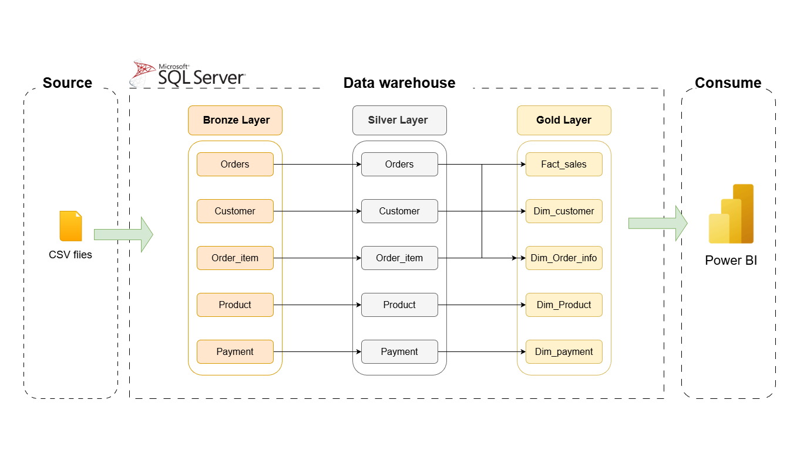

# Brazilian E-commerce Data Engineering Pipeline

## Project Overview

This repository contains an end-to-end data engineering pipeline for a Brazilian e-commerce dataset. It demonstrates how raw CSV files can be ingested, processed, modeled, and visualized using industry-standard tools. The pipeline leverages Microsoft SQL Server for ETL operations and Power BI for business analytics and reporting.

## Table of Contents

- [Project Overview](#project-overview)
- [Architecture](#architecture)
- [Workflow & ETL Stages](#workflow--etl-stages)
- [Data Warehouse Schema](#data-warehouse-schema)
- [Visualization](#visualization)
- [How to Run](#how-to-run)
- [Team Members](#team-members)

## Architecture

The diagram below illustrates the architecture of the solution, which is based on the medallion (bronze-silver-gold) data warehousing pattern.

**Pipeline Summary:**

- **Source:** Raw e-commerce CSV files
- **Data Warehouse (SQL Server):** Bronze (raw), Silver (cleaned), Gold (business-ready) layers
- **Visualization:** Interactive dashboards and reports in Power BI

## Workflow & ETL Stages

1. **Data Ingestion (Bronze Layer):**
    - Load raw CSV files into SQL Server tables.
2. **Data Transformation & Cleansing (Silver Layer):**
    - Clean, deduplicate, and standardize data using SQL transformations.
3. **Modeling & Aggregation (Gold Layer):**
    - Build star schema with fact and dimension tables/views ready for analytics.
4. **Analytics & Reporting:**
    - Connect Power BI to gold views for advanced analysis and visualization.

## Data Warehouse Schema

- **Bronze Layer:** Raw tables — `orders`, `customer`, `order_item`, `product`, `payment`
- **Silver Layer:** Cleaned tables, ready for transformation and merging
- **Gold Layer:** Analytical views  
    - `fact_sales`  
    - `dim_customer`  
    - `dim_product`  
    - `dim_order_info`  
    - `dim_payment`

## Data Analysis

### Business Insights

- What is the distribution of consumers by city and state?

  The highest customer density appears in Sao Paulo (38k customers), while the rest of the population is scattered around other states.

- What is the highest-selling product category?

  In all states, the "Toys" category dominates with 75%+ of all product sales.

- Which Quarter experienced the highest sales? Which experienced the lowest?

  Peak sales were realized in Q2 of 2018, while sales were at their lowest in Q4 of 2016.

- Which month experienced the highest amount of orders?

  August 2018 stands out with over 7.2k total orders.

- How many days does the average order get shipped? And how much does it cost to ship the order? 

  We find that the average order gets delivered around the 7-day mark, with the average shipping cost for each order being around $44. 

### Dashboard
Analytical dashboards are built with Power BI, leveraging the gold layer for business insights such as sales trends, customer segmentation, product analytics, and payment behavior.

## How to Run

1. **Clone Repo:**
git clone https://github.com/<your-username>/Brazilian-Ecommerce-online-store.git
2. **Import Data:**  
Place the provided CSV files into the `/data` folder or your SQL Server import directory.

3. **Set Up Database:**  
- Use SQL DDL scripts in `/sql/` to create bronze, silver, and gold tables/views.
- Use provided ETL scripts to perform extractions and transformations.

4. **Visualization:**  
- Open Power BI dashboard in the `/visualization` folder and connect to your SQL Server gold layer or import the exported PBIX file.
- 
## Team Members
- **Omar Khaled**  
  [www.linkedin.com/in/omarkh25](https://www.linkedin.com/in/omarkh25)
- **Abdelzaher Mohamed**  
  [www.linkedin.com/in/abdelzaher56](https://www.linkedin.com/in/abdelzaher56)

